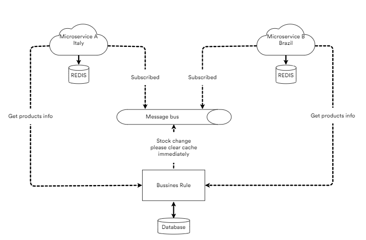

# Message Bus

Simple educational solution with Message Bus to invalidate cache between applications.



## Technologies

- .NET5.0

- RabbitMQ

- REDIS

- Docker

## Usage

```cmd
docker-compose build
docker-compose up -d
```

That will pull, build/create images and up the inteire environment.

## Principals

When the API that has Products information received a `Post` message (indicates that some products information has been changed or add a new one),
The message will be posted on RabbitMQ, all consumers will be notified and caches clean.
When requested Products information the API start over again going into the `Main` API.

### Product API

On Get return a Fake list of Products.
```cs
[HttpGet]
public IEnumerable<Product> Get()
{
    var product = new Faker<Product>()
        .RuleFor(o => o.Id, f => Guid.NewGuid())
        .RuleFor(o => o.Name, f => f.Commerce.ProductName())
        .RuleFor(o => o.Stock, f => f.Random.Int(1, 100))
        .RuleFor(o => o.Price, f => f.Random.Double(1, 1000));

    return product.Generate(new Random().Next(1, 1_100));
}
```

On Post publish a message to RabbitMQ to inform all consumers that some thing are changed.

```cs
[HttpPost]
public async Task<IActionResult> Post(ProductMessage p)
{
    // Do Somenthing important.

    await _publishEndpoint.Publish<ProductMessage>(p);
    return Ok();
}
```

### Consumer

When receives the message, the programs clear their caches.

```cs
public class ProductConsumer : IConsumer<ProductMessage>
{
    private readonly IStore _store;
    public ProductConsumer(IStore store)
    {
        _store = store;
    }
    public async Task Consume(ConsumeContext<ProductMessage> context)
    {
        await _store.ClearProductsCacheAsync();
    }
}

private static string RecordKey => nameof(Product); //Your specific Key
public async Task ClearProductsCacheAsync()
{
    await _cache.RemoveAsync(RecordKey);
}

```